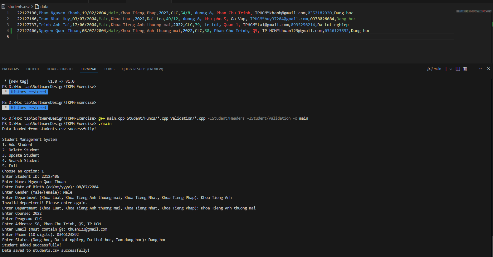
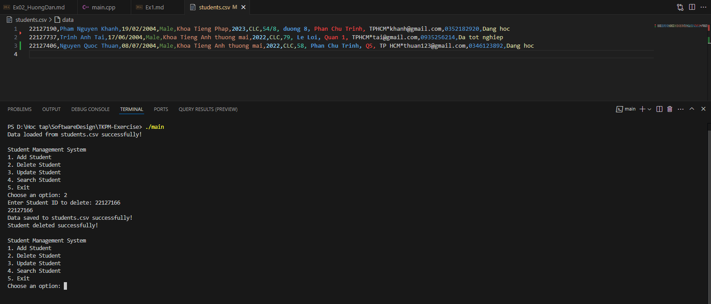
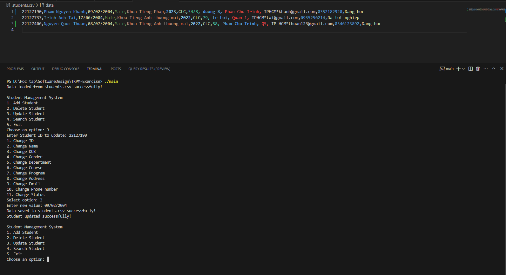
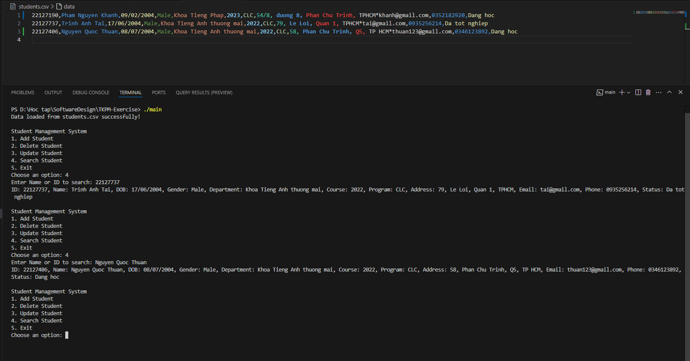

# TKPM-Ex 

 
Cách debug and run trong vscode: 
B1: Nhập "g++ main.cpp Student/Funcs/_.cpp Validation/_.cpp -IStudent/Headers -IStudent/Validation -o main" 
B2: Nhập "./main" 
 
Version 1.0: 
 
1. Thêm sinh viên mới 
   Dòng này sẽ xuống dòng ngay sau đây  
   Dòng tiếp theo 
 
   B1: Sau khi nhập ./main để chạy chương trình, nhập số 1 để thêm sinh viên 
   B2: Nhập nội dung theo ảnh sau (có kiểm tra tính hợp lệ đối với định dạng email, số điện thoại, tên khoa, tình trạng sinh viên): 

 
B3: Kiểm tra file student.csv xem có thông tin sinh viên đó chưa. 
  2. Xoá sinh viên 
B1: Sau khi nhập ./main để chạy chương trình, nhập số 2 để xoá sinh viên 
B2: Nhập ID theo ảnh để xoá thông tin sinh viên: 

 
B3: Kiểm tra file students.csv xem đã xoá sinh viên đó chưa 
  3. Cập nhật thông tin sinh viên 
B1: Sau khi nhập ./main để chạy chương trình, nhập số 3 để cập nhật thông tin sinh viên 
B2: Nhập MSSV muốn cập nhật thông tin 
B3: Chọn nội dung muốn cập nhật và cập nhật thông tin theo mẫu hình dưới đây: 

 
B3: Kiểm tra file students.csv xem đã cập nhật sinh viên đó chưa 
  4. Tìm kiếm sinh viên 
B1: Sau khi nhập ./main để chạy chương trình, nhập số 4 để tìm kiếm sinh viên 
B2: Nhập MSSV hoặc tên sinh viên muốn tìm kiếm và xem kết quả tìm kiếm như hình mẫu: 

