# TKPM-Ex 

 
Cách debug and run trong vscode: 
B1: Nhập "g++ main.cpp Student/Funcs/_.cpp Validation/_.cpp -IStudent/Headers -IStudent/Validation -o main" 
B2: Nhập "./main" 
 
Version 1.0: 
 
1. Thêm sinh viên mới 
   Dòng này sẽ xuống dòng ngay sau đây  
   Dòng tiếp theo 
 
   B1: Sau khi nhập ./main để chạy chương trình, nhập số 1 để thêm sinh viên 
   B2: Nhập nội dung theo ảnh sau (có kiểm tra tính hợp lệ đối với định dạng email, số điện thoại, tên khoa, tình trạng sinh viên): 

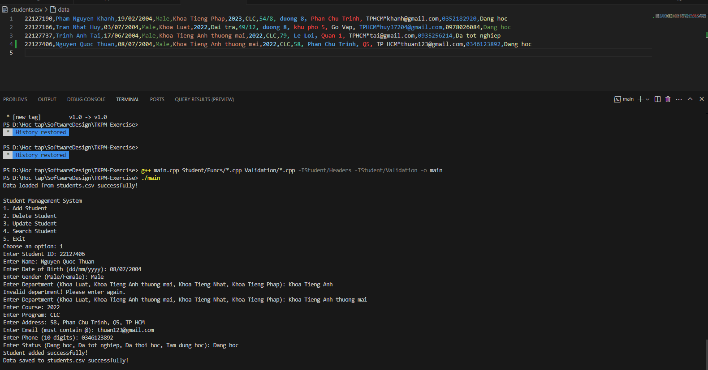
 
B3: Kiểm tra file student.csv xem có thông tin sinh viên đó chưa. 
  2. Xoá sinh viên 
B1: Sau khi nhập ./main để chạy chương trình, nhập số 2 để xoá sinh viên 
B2: Nhập ID theo ảnh để xoá thông tin sinh viên: 

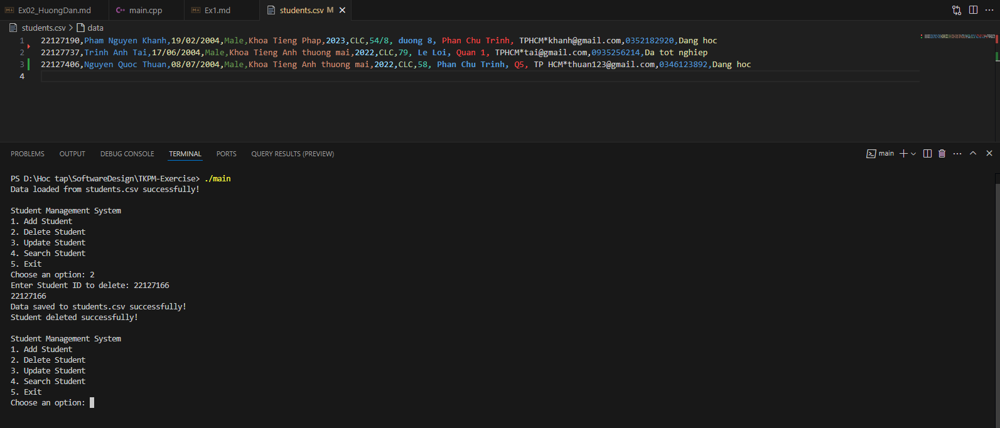
 
B3: Kiểm tra file students.csv xem đã xoá sinh viên đó chưa 
  3. Cập nhật thông tin sinh viên 
B1: Sau khi nhập ./main để chạy chương trình, nhập số 3 để cập nhật thông tin sinh viên 
B2: Nhập MSSV muốn cập nhật thông tin 
B3: Chọn nội dung muốn cập nhật và cập nhật thông tin theo mẫu hình dưới đây: 

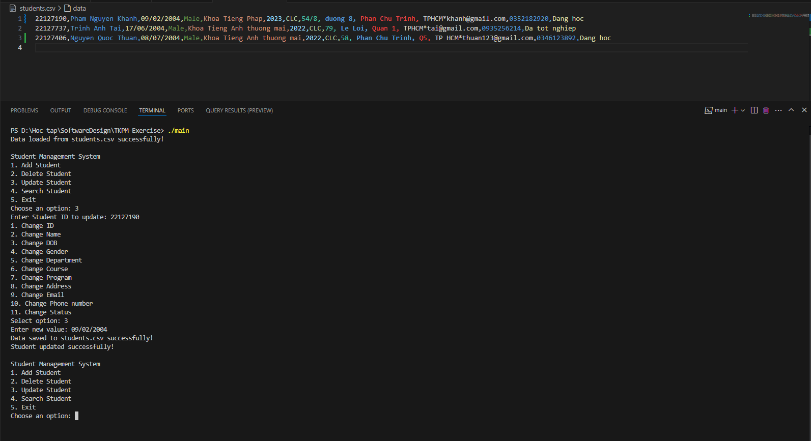
 
B3: Kiểm tra file students.csv xem đã cập nhật sinh viên đó chưa 
  4. Tìm kiếm sinh viên 
B1: Sau khi nhập ./main để chạy chương trình, nhập số 4 để tìm kiếm sinh viên 
B2: Nhập MSSV hoặc tên sinh viên muốn tìm kiếm và xem kết quả tìm kiếm như hình mẫu: 

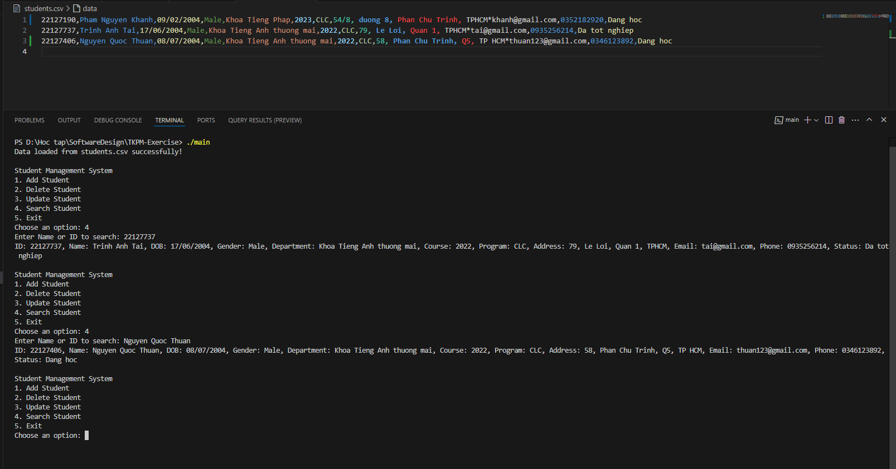

Version 2.0: 

 
Cách debug and run trong vscode: 
B1: Nhập "g++ main.cpp Student/Funcs/*.cpp Validation/*.cpp Department/*.cpp Status/*.cpp Program/*.cpp LogEvent/*.cpp ShowVersion/*.cpp -IStudent/Headers -IStudent/Validation -IStudent/Department -IStudent/Status -IStudent/Program -IStudent/LogEvent -IStudent/ShowVersion -o main" 
B2: Nhập ".\main.exe" 

 

1. Lưu trữ dữ liệu: Như ở Version 1, em lưu trữ dữ liệu dưới 2 dạng là .csv và .json, các file gồm student/status/program/department (.csv/.json)  

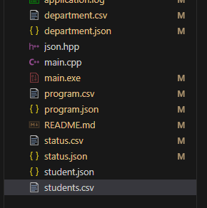

 

2. Cho phép đổi tên + thêm mới Khoa, Tình trạng sinh viên, Chương trình đào tạo  

2.1 Thêm mới Khoa 
B1: Sau khi chạy chương trình, nhập 1 để load data từ csv, 2 để load từ json 
B2: Nhập số 5 để thêm khoa 
B3: Nhập tên khoa muốn thêm. VD: Khoa Tieng Han 
B4: Kiểm tra xem khoa được thêm trong department(.csv/json) chưa 
 
Hình minh hoạ: 

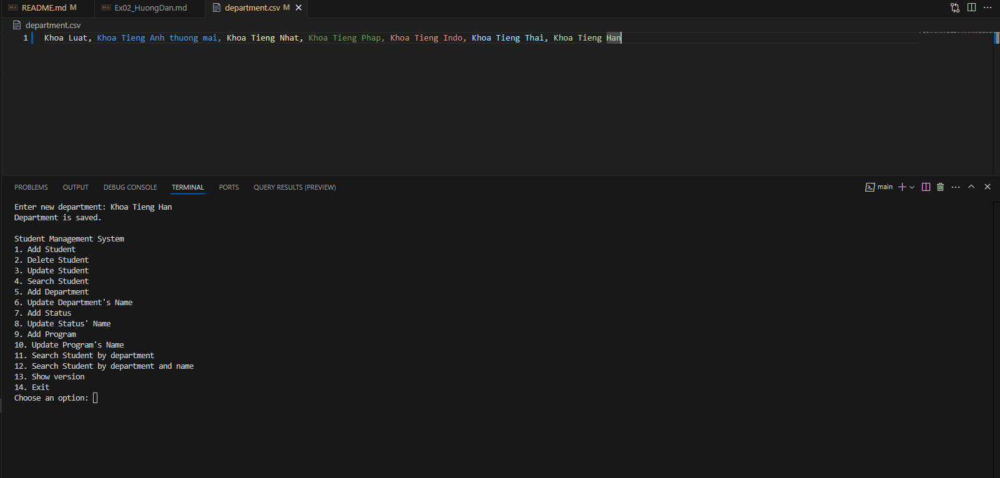
 
2.2 Đổi tên khoa  
B1: Nhập số 6 để sửa tên khoa 
B2: Nhập tên khoa muốn sửa. VD: Khoa Tieng Han 
B3: Nhập tên khoa mới. VD: Khoa Tieng Trung 
B4: Kiểm tra xem khoa đã thay đổi chưa trong department(.csv/json) và tất cả sinh viên thuộc khoa đó đã được thay đổi tên khoa chưa trong students.csv/student.json. 
 
Hình minh hoạ:  

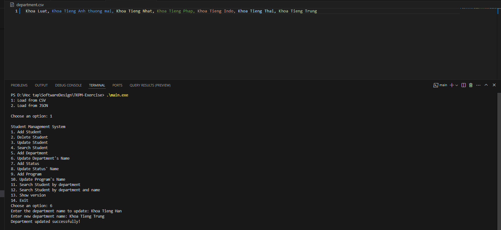

2.3 Thêm mới Tình trạng sinh viên 
B1: Sau khi chạy chương trình, nhập 1 để load data từ csv, 2 để load từ json 
B2: Nhập số 7 để thêm Tình trạng sinh viên 
B3: Nhập tên tình trạng muốn thêm. VD: Dang hoc cao hoc 
B4: Kiểm tra xem tình trạng sinh viên được thêm trong status(.csv/json) chưa 
 

Hình minh hoạ:  
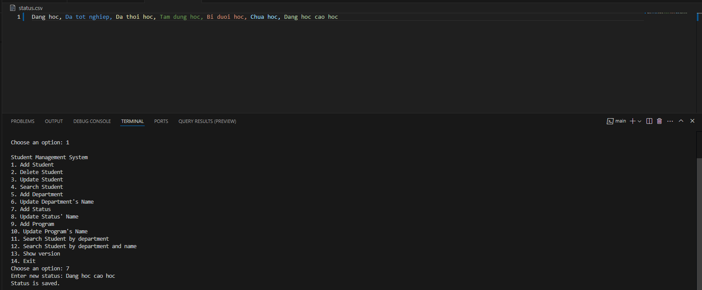

2.4 Đổi tên Tình trạng sinh viên  
B1: Nhập số 8 để sửa tên tình trạng sinh viên 
B2: Nhập tên tình trạng muốn sửa. VD: Chua hoc 
B3: Nhập tên tình trạng mới. VD: Chua hoc xong 
B4: Kiểm tra xem tình trạng sinh viên đã thay đổi chưa trong status(.csv/json) và tất cả sinh viên có tình trạng đó đã được thay đổi tên tình trạng chưa trong students.csv/student.json. 

 
Hình minh hoạ:  

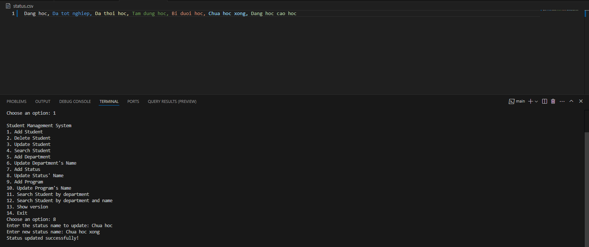

2.5 Thêm mới Chương trình 
B1: Sau khi chạy chương trình, nhập 1 để load data từ csv, 2 để load từ json 
B2: Nhập số 9 để thêm Chương trình 
B3: Nhập tên chương trình muốn thêm. VD: Tieng Nhat 
B4: Kiểm tra xem chương trình sinh viên được thêm trong program(.csv/json) chưa 
 

Hình minh hoạ:  

2.6 Đổi tên Chương trình  
B1: Nhập số 10 để sửa tên chương trình sinh viên 
B2: Nhập tên chương trình muốn sửa. VD: Tieng Nhat 
B3: Nhập tên chương trình mới. VD: Tieng Han 
B4: Kiểm tra xem chương trình đã thay đổi chưa trong program(.csv/json) và tất cả sinh viên có chương trình đó đã được thay đổi tên chương trình chưa trong students.csv/student.json. 

 
Hình minh hoạ:  

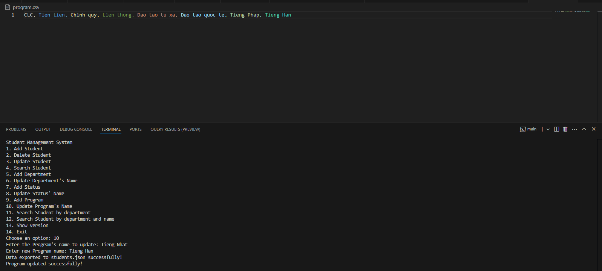

3. Tìm kiếm sinh viên theo khoa hay theo khoa và tên sinh viên: 
   3.1 Tìm kiếm sinh viên theo khoa: 
   B1: Nhập số 11 để tìm kiếm sinh viên theo khoa. 
   B2: Nhập tên khoa muốn tìm. VD: Khoa Tieng Anh thuong mai  
   B3: Xem trên màn hình terminal có các sinh viên thuộc khoa đó 
    
   Hình minh hoạ:  

   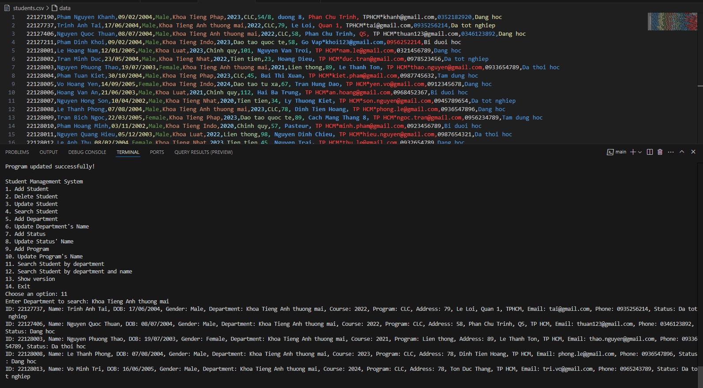

   3.2 Tìm kiếm sinh viên theo khoa và tên sinh viên: 
   B1: Nhập số 12 để tìm kiếm sinh viên theo khoa và tên. 
   B2: Nhập tên khoa muốn tìm. VD: Khoa Tieng Anh thuong mai  
   B4: Nhập tên sinh viên muốn tìm. VD: Thuan  
   B4: Xem trên màn hình terminal có các sinh viên thuộc kho và tên đó.  
    
   Hình minh hoạ:  

   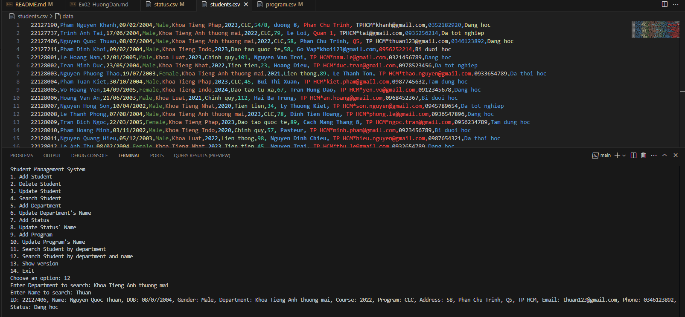

4. Hỗ trợ import/export dữ liệu bằng JSON và CSV 
   Với các chức năng thêm ở trên, em đã export vô JSON và CSV tự động. 
   Nếu muốn import từ JSON hoặc CSV, sau khi chạy chương trình bằng lệnh .\main.exe, nhấn 1 hoặc 2 để import dữ liệu từ JSON/CSV như các thao tác ở trên 

 
5. Thêm logging mechanism:  
Sau khi thao tác các chức năng trên, ấn vào file application.log ở trong thư mục TKPM-EXERCISE để xem các log.  

 
Hình minh hoạ:  

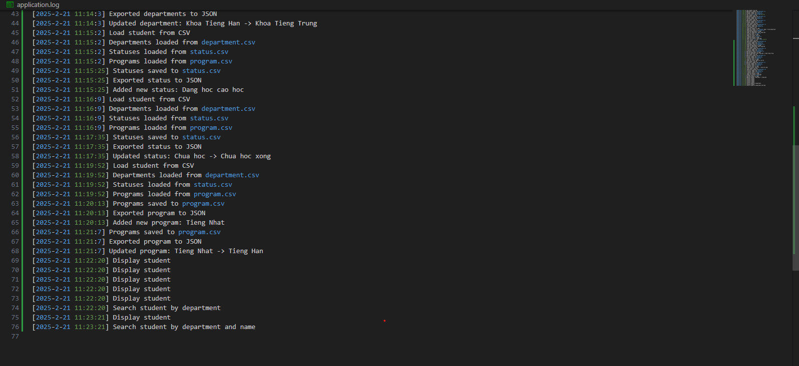
  6. Thêm show version và ngày build ứng dụng. 
B1: Sau khi chạy chương trình, nhập 1 để load data từ csv, 2 để load từ json 
B2: Nhập 13 để hiển thị show version  
B3: Xem version và ngày build ứng dụng  
 
Hình minh hoạ:  

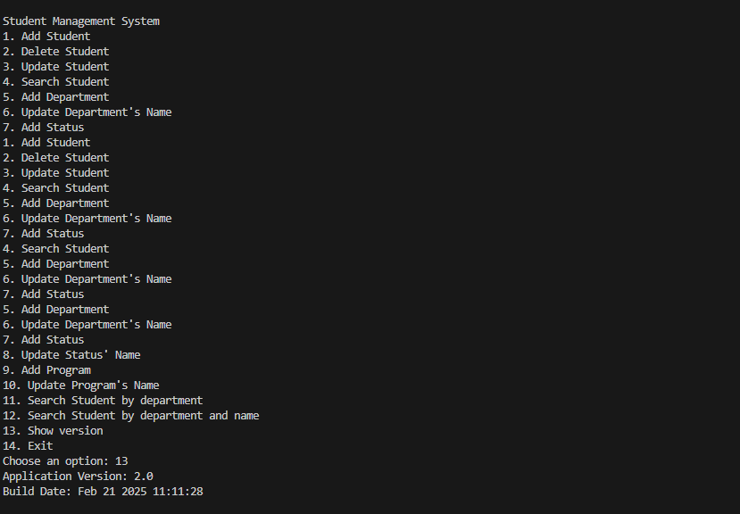

Version 3.0: 
 
Cách debug and run trong vscode: 
B1: Nhập "g++ main.cpp Student/Funcs/_.cpp Validation/_.cpp Department/_.cpp Status/_.cpp Program/_.cpp LogEvent/_.cpp ShowVersion/\*.cpp -IStudent/Headers -IStudent/Validation -IStudent/Department -IStudent/Status -IStudent/Program -IStudent/LogEvent -IStudent/ShowVersion -o main.exe" 
B2: Nhập ".\main.exe" 

3.1 + 3.2 + 3.3 MSSV phải là duy nhất, Email phải thuộc một tên miền nhất định và có thể cấu hình động, Số điện thoại phải có định dạng hợp lệ theo quốc gia 
B1: Sau khi chạy chương trình, nhập 1 để load data từ csv, 2 để load từ json 
B2: Nhập 1 để thêm sinh viên  
B3: Nhập một MSSV bất kì (đã có trong students.csv). VD: 22127190  
B4: Hệ thống sẽ báo MSSV đã tồn tại 
B5: Làm các bước tương tự như trong hình sau để kiểm tra email, số điện thoại, tình trạng sinh viên:
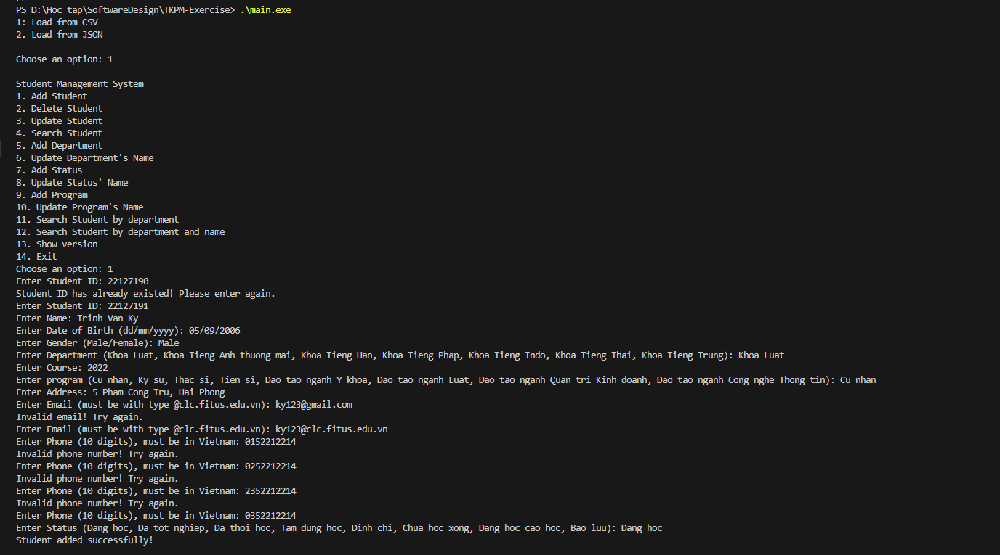

3.4 Tình trạng sinh viên chỉ có thể thay đổi theo một số quy tắc 
Các tình trạng có thể thay đổi gồm: 
Dang hoc --> Bao luu / Da tot nghiep / Dinh chi 
Bao luu --> Dang hoc / Dinh chi 

B1: Sau khi chạy chương trình, nhập 1 để load data từ csv, 2 để load từ json 
B2: Nhập 3 để cập nhật sinh viên  
B3: Nhập MSSV. VD: 22127737<brb>
B3: Nhập 11 để cập nhật trạng thái sinh viên  
B4: Nhập trạng thái mới. VD: Dang hoc 
B5: Hệ thống sẽ báo bị lỗi vì trạng thái cũ của sinh viên 22127737 là Da tot nghiep. 
Hình minh hoạ:
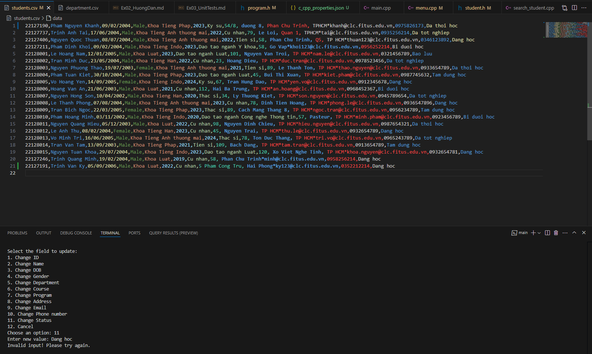

Unit test: Cách chạy:  
Các hàm mock của unit test được đặt trong thư mục tests (test_add_student.cpp, test_update_student.cpp) 
B1: Trong terminal của IDE, nhập "cmake -B build" 
B2: Sau đó nhập "cmake --build build" 
B3: Cuối cùng là chạy chương trình: "./build/tests/Debug/runTests.exe" 
B4: Kiểm tra code đã được test "PASSED" không như hình dưới đây 

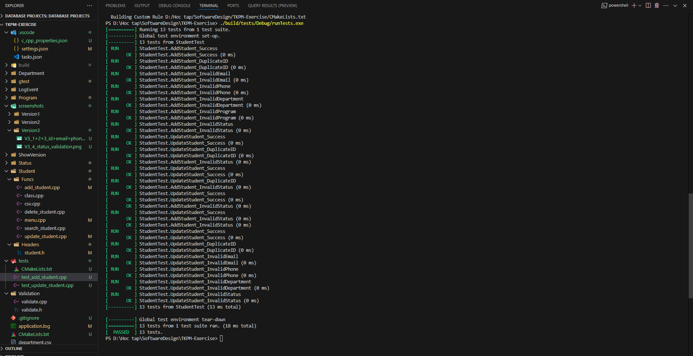
